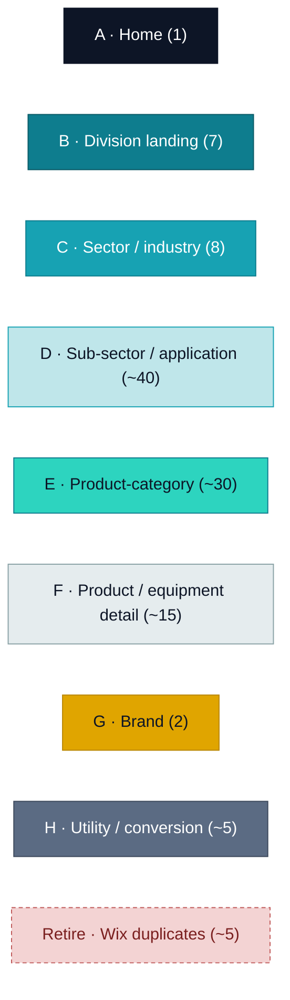
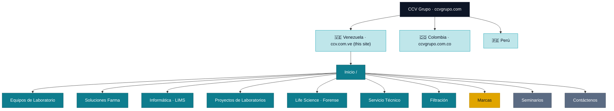
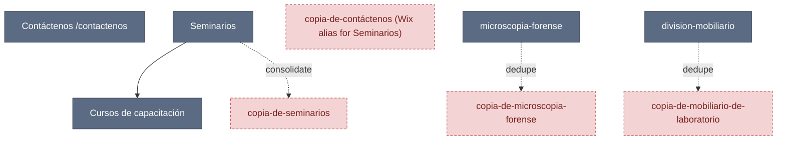
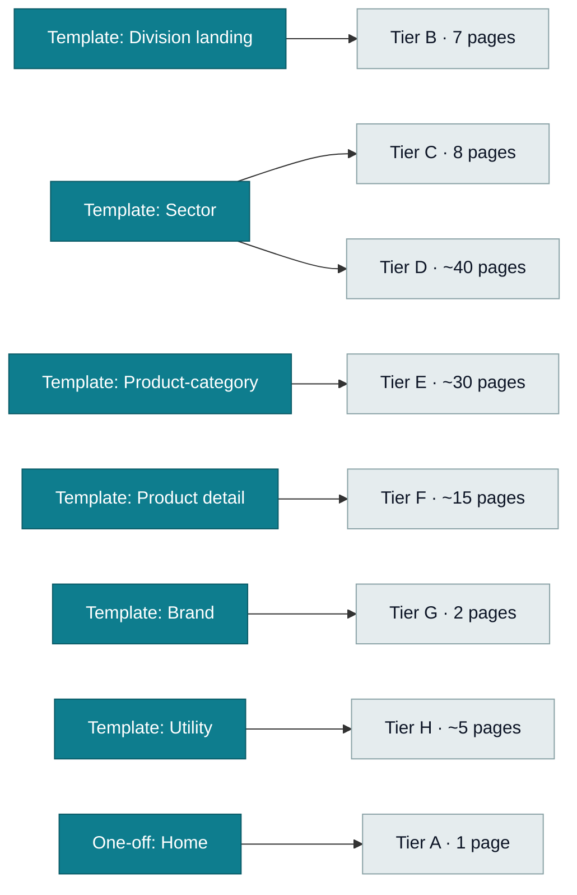

# CCV.com.ve — Site Architecture Map

Visual information architecture of `www.ccv.com.ve` (~110 live pages) and the
target **CCV Grupo** structure. GitHub renders the Mermaid blocks below as
graphs. Companion to [REVIEW-PLAN.md](REVIEW-PLAN.md).

> Sub-page parentage is partly inferred from URL slugs + standard IA and will be
> validated during content migration. `copia-de-*` pages are Wix duplicates to
> retire (see §7).

---

## Legend — page archetypes → templates

---

## 1. Global IA + CCV Grupo regions

---

## 2. Equipos de Laboratorio (sectors → applications)

```mermaid
graph TD
  classDef div fill:#0e7d8e,color:#fff,stroke:#0a5a66;
  classDef sector fill:#17a2b3,color:#fff,stroke:#0e7d8e;
  classDef sub fill:#bfe6ea,color:#0d1526,stroke:#17a2b3;

  lab["Equipos de Laboratorio<br/>/division-laboratorio"]:::div

  lab --> ayb["Alimentos y Bebidas"]:::sector
  ayb --> lacteos["Lácteos y derivados"]:::sub
  ayb --> bebidas["Bebidas"]:::sub
  ayb --> cafe["Café"]:::sub
  ayb --> cacao["Cacao y chocolate"]:::sub
  ayb --> azucar["Azucarera"]:::sub
  ayb --> aceites["Aceites y grasas comestibles"]:::sub
  ayb --> pastas["Pastas, harinas y cereales"]:::sub
  ayb --> snacks["Alimentos / snacks"]:::sub
  ayb --> balanceados["Alimentos balanceados"]:::sub
  ayb --> granos["Maíz, trigo, arroz y otros"]:::sub

  lab --> pye["Petróleo y Energía"]:::sector
  pye --> refineria["Refinería / prod. de petróleo"]:::sub
  pye --> crudo["Crudo"]:::sub
  pye --> petroq["Petroquímica"]:::sub
  pye --> elec["Electricidad"]:::sub
  pye --> lubric["Grasas y aceites lubricantes"]:::sub

  lab --> amb["Ambiente"]:::sector
  amb --> agua["Agua"]:::sub
  amb --> aire["Aire"]:::sub
  amb --> suelo["Suelo"]:::sub

  lab --> geo["Geología y Minería"]:::sector
  geo --> minera["Minera"]:::sub
  geo --> ferrosos["Ferrosos y no ferrosos"]:::sub
  geo --> metal["Metalúrgica"]:::sub

  lab --> agro["Agroindustria"]:::sector
  agro --> cannabis["Cannabis medicinal"]:::sub

  lab --> mat["Ciencia de los Materiales"]:::sector
  mat --> constr["Construcción"]:::sub
  mat --> cemento["Cemento y concreto"]:::sub
  mat --> polim["Polímeros"]:::sub
  mat --> pinturas["Pinturas, fibras y textiles"]:::sub
  mat --> vidrios["Otros materiales / vidrios"]:::sub
  mat --> corros["Corrosión"]:::sub

  lab --> quim["Industria Química"]:::sector

  lab --> fyc["Farmacéutica y Cosmética"]:::sector
  fyc --> cosm["Cosmética"]:::sub
  fyc --> farmh["Farmacéutica humana"]:::sub
  fyc --> farmv["Farmacéutica veterinaria"]:::sub
  fyc --> estab["Estabilidad de productos"]:::sub
  fyc --> micro["Microbiología"]:::sub
```

---

## 3. Soluciones Farma (categories → equipment)

```mermaid
graph TD
  classDef div fill:#0e7d8e,color:#fff,stroke:#0a5a66;
  classDef prod fill:#2dd4bf,color:#0d1526,stroke:#0e7d8e;
  classDef detail fill:#e5ecee,color:#0d1526,stroke:#8aa2a6;

  farma["Soluciones Farma<br/>/solucionesfarma"]:::div

  farma --> ing["Ingeniería Farmacéutica"]:::prod
  farma --> cont["Sistema de Contención"]:::prod
  farma --> ester["Sistema de Esterilización"]:::prod
  ester --> escs["Por calor seco"]:::detail
  ester --> esch["Por calor húmedo"]:::detail
  ester --> esaq["Por agentes químicos"]:::detail
  farma --> eqas["Equipos Asociados"]:::prod
  farma --> maq["Maquinarias de Producción"]:::prod
  farma --> liof["Sistema de Liofilización"]:::prod
  liof --> liofgmp["Liofilizadores GMP de producción"]:::detail
  liof --> lioflab["Liofilizadores de laboratorio"]:::detail
  farma --> aguapw["Agua PW & WFI y Vapor Puro"]:::prod
  aguapw --> genvap["Generadores de vapor"]:::detail
  aguapw --> destil["Destiladores múltiple/simple efecto"]:::detail
  aguapw --> almac["Almacenamiento y distribución"]:::detail
  aguapw --> tratam["Tratamiento y purificación"]:::detail
  farma --> salas["Salas Blancas y Equipos Asociados"]:::prod
  salas --> compsb["Componentes de salas blancas"]:::detail
  salas --> saspaso["SAS de paso de materiales"]:::detail
  salas --> duchas["Duchas de aire / filtración HEPA"]:::detail
  salas --> biodesc["Biodescontaminación por peróxido"]:::detail
  salas --> flujolam["Sistemas de flujo laminar"]:::detail
  farma --> cabflu["Cabina de Flujo Laminar / Seg. Biológica"]:::prod
  farma --> cargadesc["Sistema de carga-descarga"]:::prod
  farma --> contpart["Contadores de partículas de aire"]:::prod
  farma --> integ["Pruebas de integridad de filtros"]:::prod
  farma --> muestreo["Muestreo de aire (virus/micro)"]:::prod
  farma --> pruebasf["Pruebas físicas tabletas/cápsulas"]:::prod
  farma --> pesaje["Pesaje y detectores de metales"]:::prod
```

---

## 4. Life Science · Proyectos · Informática · Servicio · Marcas

```mermaid
graph TD
  classDef div fill:#0e7d8e,color:#fff,stroke:#0a5a66;
  classDef sector fill:#17a2b3,color:#fff,stroke:#0e7d8e;
  classDef prod fill:#2dd4bf,color:#0d1526,stroke:#0e7d8e;
  classDef detail fill:#e5ecee,color:#0d1526,stroke:#8aa2a6;
  classDef brand fill:#e0a500,color:#0d1526,stroke:#b98600;
  classDef util fill:#5b6b83,color:#fff,stroke:#3d495c;

  life["Life Science · Forense<br/>/life-science"]:::div
  life --> vida["Ciencia de la Vida"]:::sector
  vida --> pcr["PCR"]:::detail
  vida --> adn["Secuenciadores de ADN"]:::detail
  vida --> placas["Lectores de placas"]:::detail
  vida --> microsc["Microscopía"]:::detail
  vida --> instr["Instrumentos analíticos"]:::detail
  vida --> patol["Imágenes patológicas"]:::detail
  life --> foren["Forénsico"]:::sector
  foren --> pcrf["PCR forense"]:::detail
  foren --> placasf["Lectores de placa forense"]:::detail
  foren --> microscf["Microscopía forense"]:::detail
  foren --> instrf["Instrumentos analíticos forense"]:::detail

  proy["Proyectos de Laboratorios<br/>/division-mobiliario"]:::div
  proy --> obras["Mobiliario / diseño y ejecución de obras"]:::prod
  proy --> campanas["Campanas de extracción de gases"]:::prod
  proy --> superf["Superficies de trabajo"]:::prod
  proy --> modulares["Laboratorios modulares"]:::prod
  proy --> grif["Griferías y duchas / accesorios"]:::prod

  info["Informática · LIMS<br/>/division-informatica"]:::div
  info --> lims["LIMS"]:::prod
  info --> soft["Software"]:::prod

  serv["Servicio Técnico<br/>/servicio-tecnico"]:::div
  serv --> consult["Consultoría"]:::prod
  serv --> ingserv["Ingeniería"]:::prod

  filt["Filtración<br/>/division-filtracion"]:::div

  marcas["Marcas"]:::brand
  marcas --> perkin["PerkinElmer"]:::brand
  marcas --> binder["Binder (cámaras, hornos, incubadoras)"]:::brand
  binder --> chambers["Cámaras clima · Hornos secado · Incubadora"]:::detail
```

---

## 5. Utility / conversion + retire

---

## 6. Template coverage (what renders what)

---

## 7. Page count & cleanup summary

| Tier | Template | Pages | Action |
|------|----------|------|--------|
| A | Home (one-off) | 1 | Done ✅ |
| B | Division landing | 7 | Rebuild (Phase 1) |
| C | Sector | 8 | Rebuild (Phase 2) |
| D | Sub-sector | ~40 | Generate (Phase 4) |
| E | Product-category | ~30 | Rebuild/generate (Phase 3–4) |
| F | Product detail | ~15 | Generate (Phase 4) |
| G | Brand | 2 | Rebuild (Phase 5) |
| H | Utility | ~5 | Rebuild (Phase 5) |
| — | `copia-de-*` duplicates | ~5 | **Retire + 301 redirect** |
| **Total** | | **~110** | |
